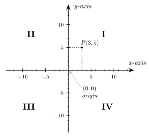

Create a new class `ArrayPointList` that holds `Point` objects.

Write the following two methods:

`public void add(Point point)`  
 - Adds a `Point` to the `ArrayPointList` object

`public int getQuadrantCount(int quadrant)`  
 - Returns the # of points in the requested quadrant.  

